# Diagrams

Create visual diagrams using Mermaid syntax directly in your Markdown.

## What is Mermaid?

[Mermaid](https://mermaid.js.org/) is a JavaScript library that generates diagrams from text definitions. It's perfect for documentation because:

- Diagrams are version-controlled as text
- No need for external diagramming tools
- Easy to update and maintain
- Renders beautifully in both light and dark modes

## Flowcharts

Create process flows:

````markdown
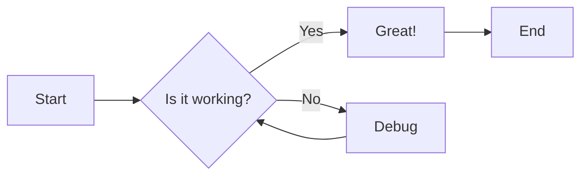
````


### Flowchart Directions

- `LR` - Left to Right
- `RL` - Right to Left
- `TB` - Top to Bottom (default)
- `BT` - Bottom to Top

## Sequence Diagrams

Show interactions between components:

````markdown
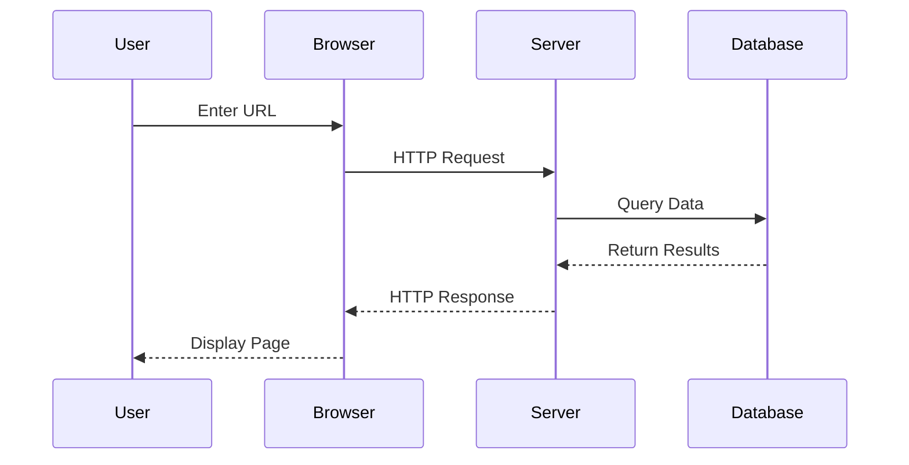
````


## Class Diagrams

Document object-oriented structures:

````markdown
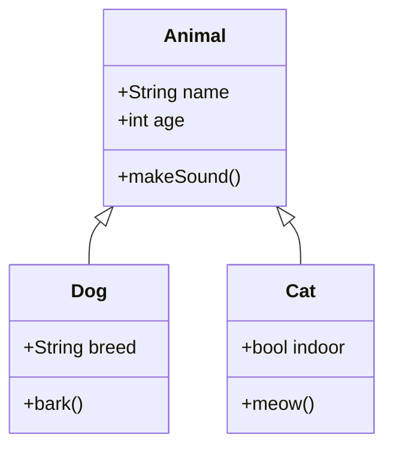
````


## State Diagrams

Show state transitions:

````markdown
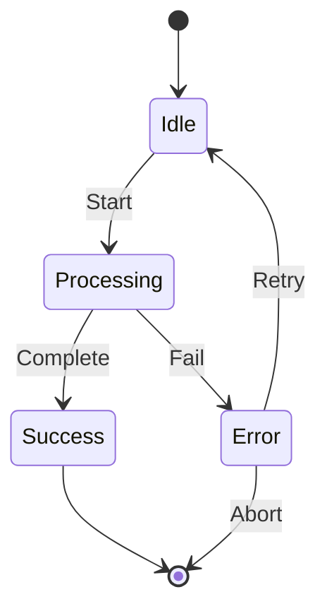
````


## Entity Relationship Diagrams

Database schema visualization:

````markdown
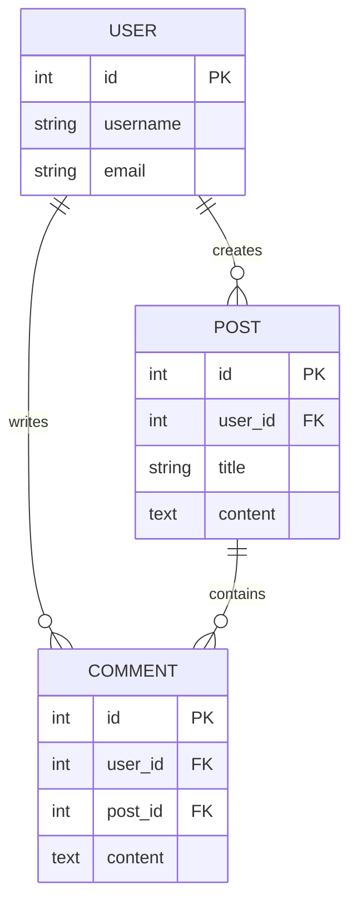
````


## Gantt Charts

Project timelines:

````markdown
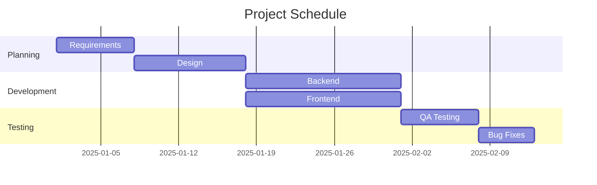
````


## Pie Charts

Show proportions:

````markdown
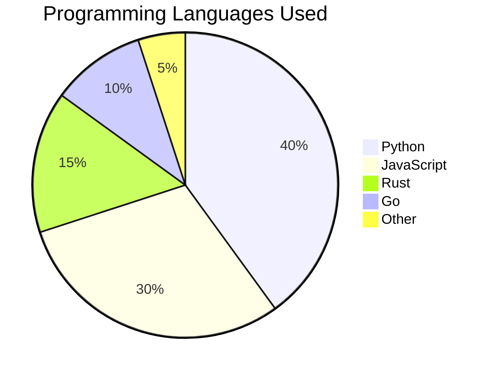
````


## Git Graph

Visualize git branches:

````markdown
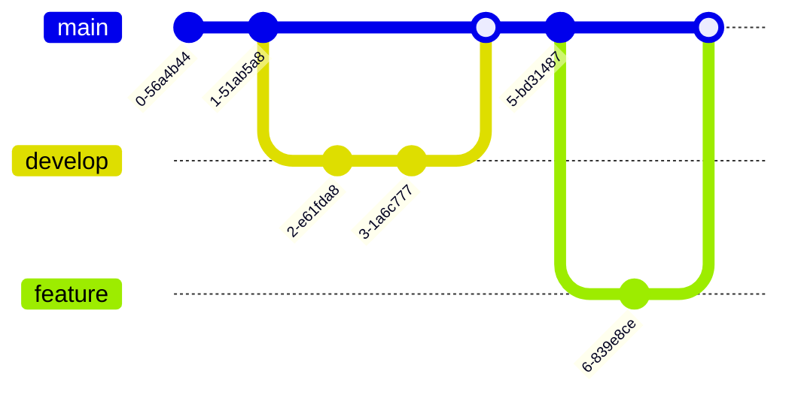
````

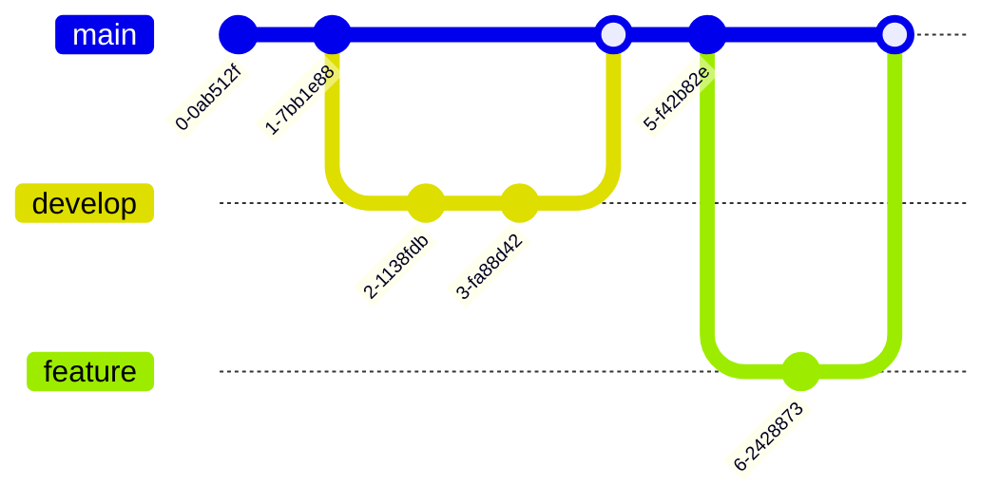

## Real-World Examples

### Authentication Flow

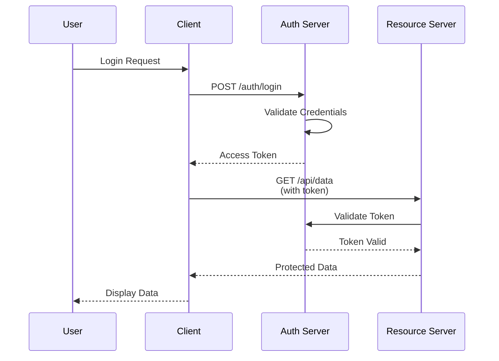

### Deployment Pipeline

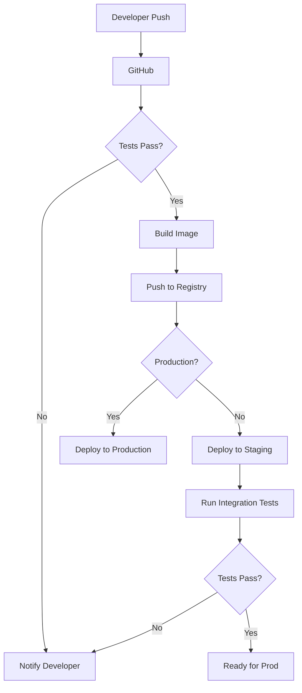

### Microservices Architecture

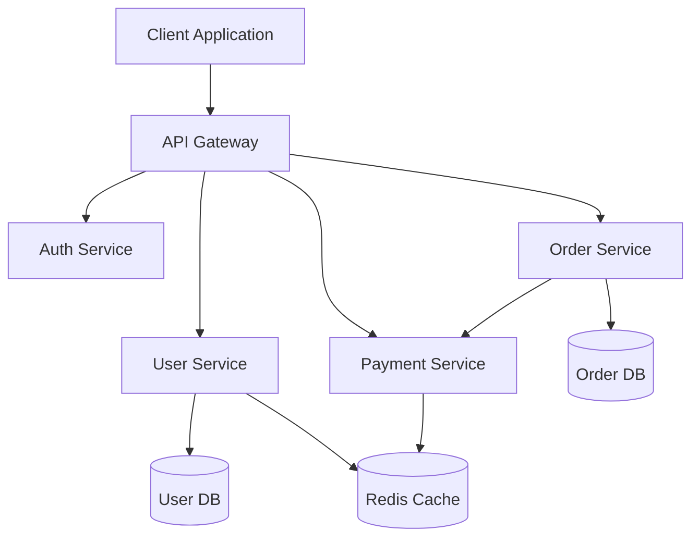

## Configuration

To enable Mermaid diagrams, add to `mkdocs.yml`:

```yaml
markdown_extensions:
  - pymdownx.superfences:
      custom_fences:
        - name: mermaid
          class: mermaid
          format: !!python/name:pymdownx.superfences.fence_code_format
```

## Styling Tips

### Node Shapes

- `[text]` - Rectangle
- `(text)` - Rounded rectangle
- `{text}` - Diamond (decision)
- `((text))` - Circle
- `>text]` - Asymmetric shape
- `[[text]]` - Subroutine

### Arrow Types

- `-->` - Solid arrow
- `-.->` - Dotted arrow
- `==>` - Thick arrow
- `--text-->` - Arrow with label
- `-->|text|` - Alternative label syntax

## Best Practices

!!! tip "Keep It Simple"
    Don't try to show everything in one diagram. Break complex systems into multiple simpler diagrams.

!!! tip "Use Meaningful Labels"
    Use clear, descriptive labels for nodes and connections.

!!! tip "Consider Your Audience"
    Technical diagrams for developers, simple flows for stakeholders.

!!! warning "Browser Rendering"
    Very complex diagrams may render slowly. If performance is an issue, consider splitting the diagram.

## Alternatives

### ASCII Diagrams

For simple diagrams, ASCII art can work:

```
┌─────────┐      ┌─────────┐      ┌─────────┐
│  Start  │─────▶│ Process │─────▶│   End   │
└─────────┘      └─────────┘      └─────────┘
```

### External Tools

For very complex diagrams:

- [Draw.io](https://draw.io) - Full-featured diagramming
- [PlantUML](https://plantuml.com) - Text-to-UML
- [Excalidraw](https://excalidraw.com) - Hand-drawn style

Save as PNG and embed:

```markdown

```

## Resources

- [Mermaid Documentation](https://mermaid.js.org/)
- [Mermaid Live Editor](https://mermaid.live/) - Test your diagrams
- [PyMdown Extensions](https://facelessuser.github.io/pymdown-extensions/)

## Next Steps

- [Writing Pages](writing-pages.md) - General content guidelines
- [Code Blocks](code-blocks.md) - Syntax highlighting
- [Markdown Tips](markdown-tips.md) - Advanced features

---

**Visualize your ideas!** 📊

