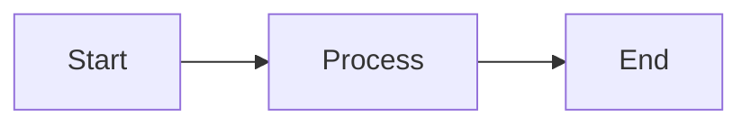

# Markdown Tips

Advanced Markdown features enabled by PyMdown Extensions.

## Keyboard Keys

Show keyboard shortcuts:

```markdown
Press ++ctrl+alt+delete++ to restart.
Use ++cmd+c++ to copy.
Press ++enter++ to submit.
```

Press ++ctrl+alt+delete++ to restart.
Use ++cmd+c++ to copy.

## Emoji

Add emoji with shortcodes:

```markdown
:smile: :rocket: :tada: :fire: :heart:
:snake: :computer: :book: :bulb: :warning:
```

:smile: :rocket: :tada: :fire: :heart:
:snake: :computer: :book: :bulb: :warning:

[Full emoji list](https://emojipedia.org/)

## Smart Symbols

Automatic symbol replacement:

```markdown
(c) (r) (tm)
c/o +/- -->
!=  =/= 1/4 1st 2nd
```

(c) (r) (tm)  
c/o +/- -->  
!= =/= 1/4 1st 2nd

## Superscript and Subscript

```markdown
H~2~O (subscript)
X^2^ + Y^2^ = Z^2^ (superscript)
```

H~2~O  
X^2^ + Y^2^ = Z^2^

## Highlighting

Mark important text:

```markdown
==This is highlighted text==
```

==This is highlighted text==

## Insertion and Deletion

Show edits:

```markdown
~~Deleted text~~
^^Inserted text^^
```

~~Deleted text~~  
^^Inserted text^^

## Abbreviations

Define abbreviations that show on hover:

```markdown
The HTML specification is maintained by the W3C.

*[HTML]: Hyper Text Markup Language
*[W3C]: World Wide Web Consortium
```

The HTML specification is maintained by the W3C.

*[HTML]: Hyper Text Markup Language
*[W3C]: World Wide Web Consortium

(Hover over HTML and W3C to see definitions)

## Definition Lists

```markdown
Term 1
:   Definition for term 1

Term 2
:   Definition for term 2
:   Another definition for term 2
```

Term 1
:   Definition for term 1

Term 2
:   Definition for term 2
:   Another definition for term 2

## Footnotes

Add footnotes to your content:

```markdown
Here's a sentence with a footnote[^1].

[^1]: This is the footnote content.
```

Here's a sentence with a footnote[^1].

[^1]: This is the footnote content.

## Content Tabs

Create tabbed content:

```markdown
=== "Python"

    ```python
    def hello():
        print("Hello!")
    ```

=== "JavaScript"

    ```javascript
    function hello() {
        console.log("Hello!");
    }
    ```

=== "Ruby"

    ```ruby
    def hello
        puts "Hello!"
    end
    ```
```

=== "Python"

    ```python
    def hello():
        print("Hello!")
    ```

=== "JavaScript"

    ```javascript
    function hello() {
        console.log("Hello!");
    }
    ```

=== "Ruby"

    ```ruby
    def hello
        puts "Hello!"
    end
    ```

## Nested Lists

Complex list structures:

```markdown
1. First item
   
   This is the first item's content.
   
   - Nested bullet point
   - Another one
   
2. Second item
   
   ```python
   # Code in a list
   print("hello")
   ```
   
3. Third item
```

1. First item
   
   This is the first item's content.
   
   - Nested bullet point
   - Another one
   
2. Second item
   
   ```python
   # Code in a list
   print("hello")
   ```
   
3. Third item

## Admonition Types

All available admonition types:

```markdown
!!! note
    Informational note.

!!! abstract
    Summary or abstract.

!!! info
    Additional information.

!!! tip
    Helpful tip.

!!! success
    Success message.

!!! question
    Question or FAQ.

!!! warning
    Warning message.

!!! failure
    Error or failure.

!!! danger
    Danger warning.

!!! bug
    Known bug.

!!! example
    Example content.

!!! quote
    Quotation.
```

!!! note
    Informational note.

!!! tip
    Helpful tip.

!!! warning
    Warning message.

!!! danger
    Danger warning.

## Inline Code with Highlighting

Highlight specific parts of inline code:

```markdown
The function `#!python print("hello")` outputs text.
Run `#!bash ls -la` to list files.
```

The function `#!python print("hello")` outputs text.

## Math (MathJax/KaTeX)

If you've enabled math support, you can write equations:

**Inline math:**

```markdown
The formula \(E = mc^2\) is Einstein's famous equation.
```

**Block math:**

```markdown
$$
\frac{-b \pm \sqrt{b^2 - 4ac}}{2a}
$$
```

\[
\frac{-b \pm \sqrt{b^2 - 4ac}}{2a}
\]

## Attribute Lists

Add CSS classes and IDs to elements:

```markdown
This paragraph has a class. { .special-class }

## Header with ID { #custom-id }

{ width="300" }

[Link with title](https://example.com){ target="_blank" }
```

## Grid Cards

Create card layouts:

```markdown
<div class="grid cards" markdown>

- :material-clock-fast: **Quick Setup**
  
  ---
  
  Get started in under 5 minutes

- :material-check-bold: **Easy to Use**
  
  ---
  
  Simple and intuitive interface

- :material-scale-balance: **Open Source**
  
  ---
  
  MIT licensed

- :material-account-group: **Community**
  
  ---
  
  Join our growing community

</div>
```

## Buttons

Create button-style links:

```markdown
[Get Started :material-arrow-right:](#){ .md-button }
[Download :material-download:](#){ .md-button .md-button--primary }
```

## Details/Summary

Collapsible sections:

```markdown
<details>
<summary>Click to expand</summary>

Hidden content goes here.

- Can include
- Any markdown
- Elements

</details>
```

<details>
<summary>Click to expand</summary>

Hidden content goes here.

- Can include
- Any markdown
- Elements

</details>

## Tables with Complex Content

Tables can contain rich content:

```markdown
| Feature | Basic | Pro |
|---------|-------|-----|
| Storage | 5 GB  | Unlimited |
| Support | Email | 24/7 Phone |
| Price   | Free  | $10/mo |
```

## Critical and Criticmark

Show important text:

```markdown
^^This is inserted^^

~~This is deleted~~

{~~Deleted~>Replaced~~}

{++Added++}

{==Highlighted==}
```

## Progress Bars

```markdown
[=0% "0%"]
[=25% "25%"]
[=50% "50%"]
[=75% "75%"]
[=100% "100%"]
```

## Snippets

Include content from other files:

```markdown
--8<-- "includes/abbreviations.md"
```

## Custom Fences

Create custom code blocks:

````markdown

````

## Using HTML

You can mix HTML with Markdown:

```markdown
<div style="border: 2px solid blue; padding: 1em;">
    
This is **Markdown** inside HTML.

</div>

<center>
Centered text
</center>
```

<div style="border: 2px solid blue; padding: 1em;">
    
This is **Markdown** inside HTML.

</div>

## Line Numbers in Code

````markdown
```python linenums="1"
def fibonacci(n):
    if n <= 1:
        return n
    return fibonacci(n-1) + fibonacci(n-2)
```
````

```python linenums="1"
def fibonacci(n):
    if n <= 1:
        return n
    return fibonacci(n-1) + fibonacci(n-2)
```

## Code with Title

````markdown
```python title="fibonacci.py"
def fib(n):
    return n if n <= 1 else fib(n-1) + fib(n-2)
```
````

```python title="fibonacci.py"
def fib(n):
    return n if n <= 1 else fib(n-1) + fib(n-2)
```

## Icons

Use Material Design icons:

```markdown
:material-account: User Account
:fontawesome-brands-github: GitHub
:octicons-mark-github-16: Octicons
```

:material-account: User Account  
:fontawesome-brands-github: GitHub

## Tips for Using These Features

!!! tip "Don't Overdo It"
    Use these features purposefully. Too many special effects can be distracting.

!!! warning "Check Compatibility"
    Make sure the extensions you need are enabled in `mkdocs.yml`.

!!! example "Mix and Match"
    Combine features thoughtfully:
    
    === "Example 1"
        
        !!! success "With Tabs"
            Admonitions inside tabs!
    
    === "Example 2"
        
        | Feature | Enabled |
        |---------|---------|
        | Tables  | :white_check_mark: |
        | Tabs    | :white_check_mark: |

## Enabling Extensions

To use these features, ensure your `mkdocs.yml` includes:

```yaml
markdown_extensions:
  - abbr
  - admonition
  - attr_list
  - def_list
  - footnotes
  - pymdownx.arithmatex
  - pymdownx.betterem
  - pymdownx.caret
  - pymdownx.critic
  - pymdownx.details
  - pymdownx.emoji:
      emoji_index: !!python/name:material.extensions.emoji.twemoji
  - pymdownx.highlight
  - pymdownx.keys
  - pymdownx.mark
  - pymdownx.smartsymbols
  - pymdownx.superfences
  - pymdownx.tabbed:
      alternate_style: true
  - pymdownx.tasklist:
      custom_checkbox: true
  - pymdownx.tilde
```

## Learning More

- [PyMdown Extensions Documentation](https://facelessuser.github.io/pymdown-extensions/)
- [Material for MkDocs Reference](https://squidfunk.github.io/mkdocs-material/reference/)
- [Markdown Guide](https://www.markdownguide.org/)

## Next Steps

- [Code Blocks](code-blocks.md) - Advanced code features
- [Diagrams](diagrams.md) - Create visual diagrams
- [Writing Pages](writing-pages.md) - Back to basics

---

**Experiment and have fun!** 🎨

