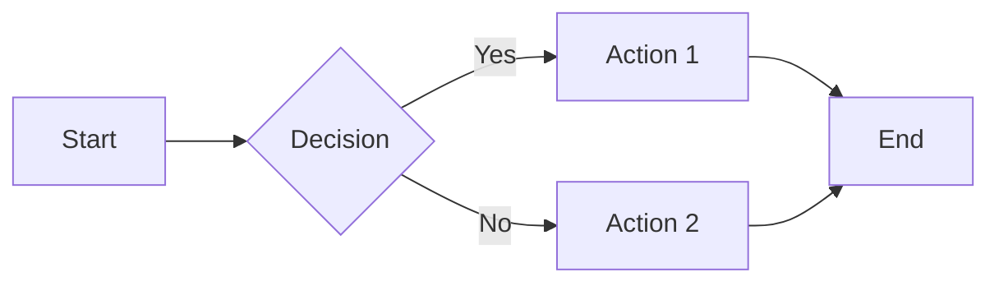

# Sample Page

This page demonstrates various features you can use in your wiki.

## Text Formatting

This is a paragraph with **bold text**, *italic text*, and `inline code`.

You can also use ==highlighted text==, ~~strikethrough~~, and combine formats like ***bold italic***.

## Lists

**Bullet list:**

- First item
- Second item
  - Nested item
  - Another nested item
- Third item

**Numbered list:**

1. Step one
2. Step two
3. Step three

**Task list:**

- [x] Completed task
- [ ] Pending task
- [ ] Another pending task

## Admonitions

!!! note "Important Note"
    This is an important note that readers should pay attention to.

!!! tip "Pro Tip"
    Here's a helpful tip for users!

!!! warning "Warning"
    Be careful with this operation.

!!! danger "Danger"
    This action cannot be undone!

## Code Examples

Inline code: `print("Hello, World!")`

Code block with syntax highlighting:

```python
def greet(name):
    """Greet someone by name."""
    return f"Hello, {name}!"

# Usage
message = greet("World")
print(message)
```

## Tables

| Feature | Status | Notes |
|---------|--------|-------|
| Dark mode | ✅ | Fully supported |
| Search | ✅ | Built-in |
| Mobile | ✅ | Responsive design |
| PDF Export | ⚠️ | Optional plugin |

## Links

[Link to homepage](../index.md)  
[External link](https://www.mkdocs.org)  
[Link with title](https://github.com "GitHub")

## Images


## Quotes

> This is a blockquote.
> It can span multiple lines.
>
> — Author Name

## Horizontal Rule

---

## Emoji

:smile: :rocket: :heart: :tada: :fire:

## Tabs

=== "Tab 1"

    Content for tab 1

=== "Tab 2"

    Content for tab 2

=== "Tab 3"

    Content for tab 3

## Diagrams



---

This sample page demonstrates the most common features. Explore other documentation pages to learn more!

